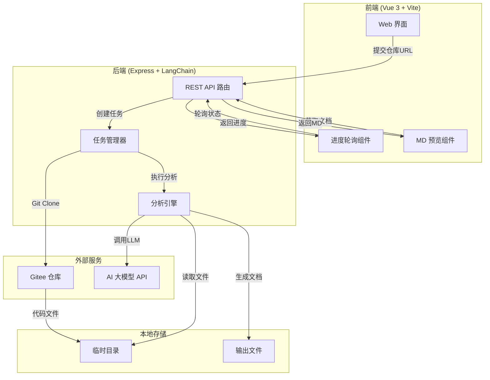
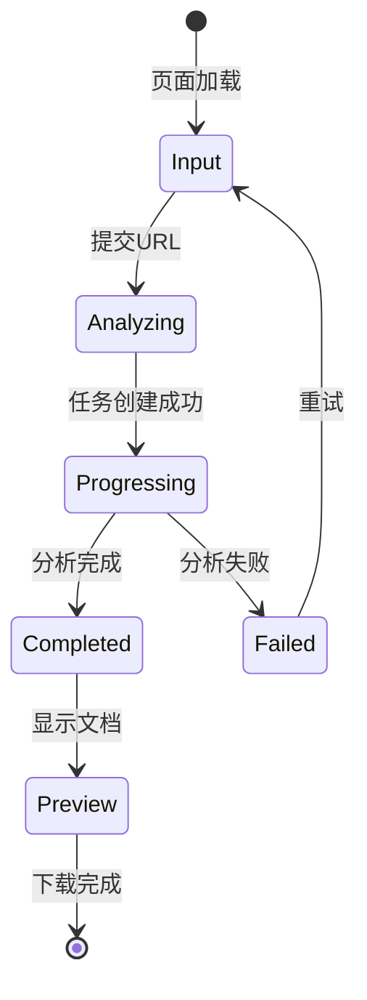
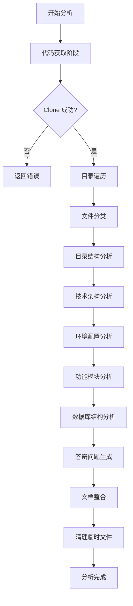
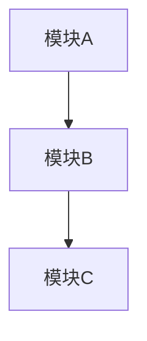

# 设计文档 - DeepWiki 代码仓库分析工具

## 1. 技术架构

### 1.1 技术选型

| 层级          | 技术栈                | 版本要求 | 说明                         |
| ------------- | --------------------- | -------- | ---------------------------- |
| 前端框架      | Vue 3                 | ^3.4.x   | 响应式 UI，Composition API   |
| 前端构建      | Vite                  | ^5.x     | 快速开发构建                 |
| 后端框架      | Express               | ^4.18.x  | RESTful API 服务             |
| AI 框架       | LangChain             | ^0.1.x   | LLM 编排框架                 |
| AI 模型       | OpenAI Compatible API | -        | 支持 OpenAI/DeepSeek/Qwen 等 |
| 代码克隆      | simple-git            | ^3.x     | Git 操作库                   |
| Markdown 渲染 | marked                | ^12.x    | MD 预览渲染                  |
| 代码高亮      | highlight.js          | ^11.x    | 代码语法高亮                 |
| 进度通信      | 轮询 API              | -        | 前端轮询获取任务状态         |

### 1.2 系统架构



### 1.3 核心模块描述

| 模块           | 职责                              | 技术实现          |
| -------------- | --------------------------------- | ----------------- |
| **API 层**     | 处理 HTTP 请求，参数验证          | Express Router    |
| **任务管理器** | 任务创建、状态追踪、并发控制      | 内存 Map + 状态机 |
| **代码获取器** | Git Clone、目录遍历、文件读取     | simple-git + fs   |
| **分析引擎**   | 分模块分析、Prompt 编排、结果整合 | LangChain Chain   |
| **文档生成器** | 模板渲染、mermaid 图表生成        | 字符串模板        |
| **前端界面**   | 用户交互、进度展示、文档预览      | Vue 3 SPA         |

---

## 2. 详细设计

### 2.1 前端设计

#### 2.1.1 UI 组件结构

```
src/
├── App.vue                 # 根组件
├── components/
│   ├── RepoInput.vue       # 仓库URL输入组件
│   ├── ProgressPanel.vue   # 进度展示面板
│   ├── DocumentPreview.vue # MD文档预览组件
│   └── DownloadButton.vue  # 下载按钮组件
├── services/
│   └── api.js              # API调用封装
├── styles/
│   └── main.css            # 样式文件
└── main.js                 # 入口文件
```

#### 2.1.2 页面流程



#### 2.1.3 进度展示设计

进度分为 6 个阶段：

1. **代码获取** (0-15%) - Git Clone 仓库
2. **目录分析** (15-25%) - 解析目录结构
3. **架构分析** (25-40%) - 分析技术栈
4. **模块分析** (40-60%) - 功能模块识别
5. **数据库分析** (60-80%) - 数据结构解析
6. **文档生成** (80-100%) - 整合输出文档

### 2.2 后端设计

#### 2.2.1 API 接口设计

| 接口                    | 方法 | 说明         | 请求体              | 响应体                              |
| ----------------------- | ---- | ------------ | ------------------- | ----------------------------------- |
| `/api/analyze`          | POST | 提交分析任务 | `{repoUrl: string}` | `{taskId: string}`                  |
| `/api/status/:taskId`   | GET  | 查询任务状态 | -                   | `{status, progress, stage, error?}` |
| `/api/result/:taskId`   | GET  | 获取分析结果 | -                   | `{content: string}` (MD 文档)       |
| `/api/download/:taskId` | GET  | 下载 MD 文件 | -                   | 文件流                              |

#### 2.2.2 数据模型设计

```javascript
// 任务状态模型
{
  taskId: string,        // UUID
  repoUrl: string,       // 仓库URL
  status: 'pending' | 'processing' | 'completed' | 'failed',
  progress: number,      // 0-100
  stage: string,         // 当前阶段描述
  repoPath: string,      // 本地临时目录路径
  result: string,        // 生成的MD文档内容
  error: string,         // 错误信息
  createdAt: Date,       // 创建时间
  updatedAt: Date        // 更新时间
}
```

#### 2.2.3 分析引擎设计



#### 2.2.4 Prompt 模板设计

每个分析阶段使用独立的 Prompt 模板：

1. **目录分析 Prompt**: 分析目录结构，识别项目组织方式
2. **架构分析 Prompt**: 识别技术栈、框架、架构模式
3. **模块分析 Prompt**: 分析核心功能模块、生成流程图
4. **数据库分析 Prompt**: 解析数据库结构、生成 ER 图
5. **答辩问题 Prompt**: 基于项目特点生成问答对

### 2.3 目录结构设计

```
deepwiki-analyzer/
├── .env                        # 环境配置文件
├── .env.example                # 环境配置模板
├── package.json                # 项目依赖
├── README.md                   # 项目说明
│
├── server/                     # 后端代码
│   ├── index.js               # 服务入口
│   ├── routes/                # API路由
│   │   └── analyze.js         # 分析相关路由
│   ├── services/              # 业务服务
│   │   ├── gitService.js      # Git操作服务
│   │   ├── analyzerService.js # 分析引擎服务
│   │   └── taskManager.js     # 任务管理服务
│   ├── prompts/               # Prompt模板
│   │   ├── directory.js       # 目录分析模板
│   │   ├── architecture.js    # 架构分析模板
│   │   ├── modules.js         # 模块分析模板
│   │   ├── database.js        # 数据库分析模板
│   │   └── qa.js              # 答辩问题模板
│   └── utils/                 # 工具函数
│       ├── fileUtils.js       # 文件操作工具
│       └── llmUtils.js        # LLM调用工具
│
└── client/                     # 前端代码
    ├── index.html             # HTML入口
    ├── src/
    │   ├── main.js            # Vue入口
    │   ├── App.vue            # 根组件
    │   ├── components/        # Vue组件
    │   │   ├── RepoInput.vue
    │   │   ├── ProgressPanel.vue
    │   │   ├── DocumentPreview.vue
    │   │   └── DownloadButton.vue
    │   ├── services/
    │   │   └── api.js         # API调用
    │   └── styles/
    │       └── main.css       # 样式
    ├── vite.config.js         # Vite配置
    └── package.json           # 前端依赖
```

---

## 3. 质量保证

### 3.1 测试策略

| 测试类型 | 范围               | 工具              |
| -------- | ------------------ | ----------------- |
| 单元测试 | 工具函数、服务方法 | Jest              |
| 集成测试 | API 接口           | Supertest         |
| E2E 测试 | 用户流程           | Playwright (可选) |

### 3.2 性能优化计划

1. **文件读取优化**: 限制读取文件大小，跳过二进制文件和 node_modules
2. **LLM 调用优化**: 分块处理大文件，并行调用独立分析任务
3. **临时文件管理**: 分析完成立即清理，设置定时清理过期文件
4. **前端优化**: 防抖轮询、虚拟滚动（长文档）

### 3.3 安全保护措施

1. **输入验证**: 严格验证 Gitee URL 格式，防止 SSRF 攻击
2. **路径安全**: 限制 Clone 目录范围，防止目录遍历
3. **资源限制**: 设置仓库大小上限、分析超时时间
4. **敏感信息**: API Key 仅从环境变量读取，不记录日志

### 3.4 监控和告警计划

1. **日志记录**: 记录每个任务的执行时间、错误信息
2. **错误追踪**: 捕获并记录未处理异常
3. **资源监控**: 监控临时目录磁盘占用

---

## 4. 关键技术点

### 4.1 LangChain 链式调用

```javascript
// 分析链示例
const analysisChain = RunnableSequence.from([
  {
    context: (input) => input.fileContent,
    question: (input) => input.analysisPrompt,
  },
  promptTemplate,
  model,
  new StringOutputParser(),
]);
```

### 4.2 进度回调机制

```javascript
// 任务进度更新
const updateProgress = (taskId, stage, progress) => {
  const task = tasks.get(taskId);
  task.stage = stage;
  task.progress = progress;
  task.updatedAt = new Date();
};
```

### 4.3 Mermaid 图表生成

分析结果中的流程图、架构图、ER 图均使用 mermaid 语法：


